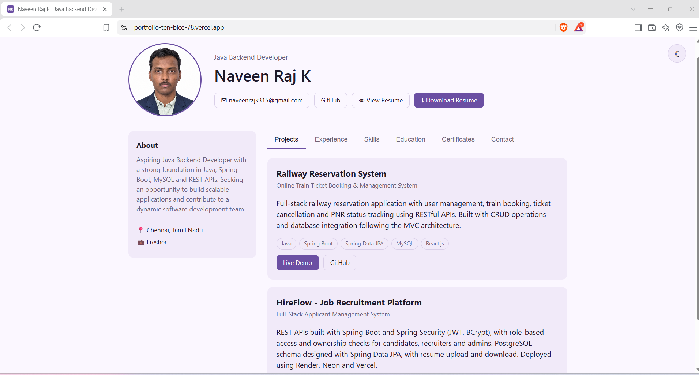
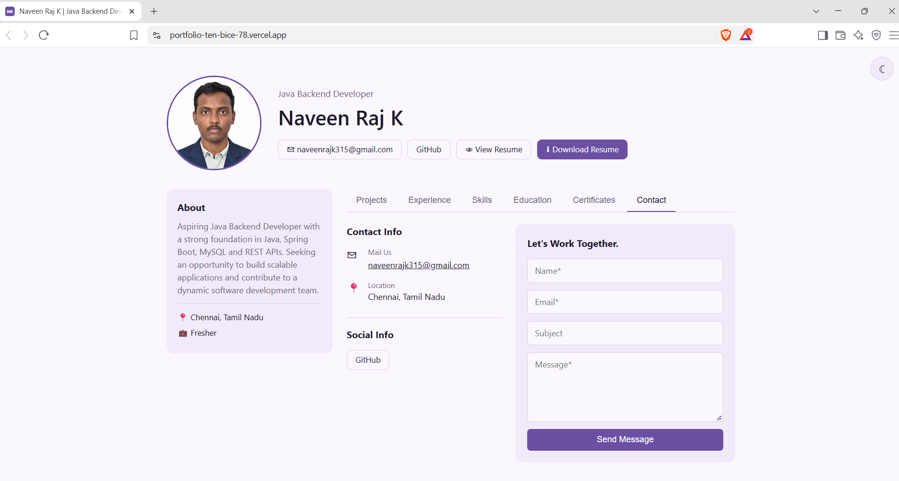

# Naveen Raj K | Developer Portfolio

A full-stack personal portfolio website for **Naveen Raj K**, an aspiring Java Backend Developer from Chennai, Tamil Nadu. A Spring Boot REST API serves the portfolio content from a PostgreSQL database, and a React frontend displays it. Visitors can send messages through the contact form, which are saved in the database.

**Live Demo:** [portfolio-ten-bice-78.vercel.app](https://portfolio-ten-bice-78.vercel.app)

---

## Screenshots

### Projects


### Contact


---

## Features

- Tabbed single-page layout: Projects, Experience, Skills, Education, Certificates, Contact
- Profile section with photo, About, location and status
- View Resume and Download Resume buttons
- Certificate gallery with images
- Contact form that saves messages to PostgreSQL
- Light / dark theme toggle
- Responsive, clean UI
- Layered Spring Boot backend (controller, service, repository, entity, DTO)
- Separate local and production configuration
- Admin key protection for admin-only access
- Dockerized backend for deployment

---

## Tech Stack

| Layer      | Technology                                           |
|------------|------------------------------------------------------|
| Frontend   | React, Vite, CSS                                     |
| Backend    | Java, Spring Boot, Spring Data JPA, REST APIs        |
| Database   | PostgreSQL (Neon)                                    |
| Deployment | Vercel (frontend), Render (backend), Neon (database) |
| Tools      | Git, GitHub, Docker, Maven, Postman                  |

---

## Project Structure

```
portfolio/
├── backend/                     # Spring Boot REST API
│   ├── src/main/java/com/naveen/portfolio/
│   │   ├── config/
│   │   ├── controller/
│   │   ├── dto/
│   │   ├── entity/
│   │   ├── repository/
│   │   ├── service/
│   │   └── PortfolioBackendApplication.java
│   ├── src/main/resources/
│   │   ├── application.properties
│   │   ├── application-local.properties
│   │   └── application-prod.properties
│   ├── Dockerfile
│   ├── mvnw
│   └── pom.xml
├── frontend/                    # React + Vite app
│   ├── src/
│   │   ├── components/          # About, Projects, Experience, Skills,
│   │   │                        # Education, Certificates, Contact, Header, Tabs
│   │   ├── services/api.js      # API calls to the backend
│   │   ├── App.jsx
│   │   └── main.jsx
│   ├── .env.example
│   ├── index.html
│   ├── package.json
│   └── vite.config.js
├── docs/                        # README screenshots
├── .gitignore
├── LICENSE
└── README.md
```

---

## Database

The PostgreSQL database is hosted on Neon and contains these tables:

| Table              | Purpose                                   |
|--------------------|-------------------------------------------|
| `projects`         | Portfolio projects                        |
| `experience`       | Work experience and internships           |
| `skills`           | Skills grouped by category                |
| `education`        | Education history                         |
| `certificates`     | Certificates with images                  |
| `contact_messages` | Messages sent from the contact form       |

The `contact_messages` table has the columns `id`, `name`, `email`, `subject`, `message` and `sent_at`.

---

## REST API

The Spring Boot backend exposes REST endpoints that return JSON and are consumed by the React frontend through `frontend/src/services/api.js`.

| Resource       | Access     | What it does                                 |
|----------------|------------|----------------------------------------------|
| Projects       | Public     | Returns the list of projects                 |
| Experience     | Public     | Returns work experience                      |
| Skills         | Public     | Returns skills grouped by category           |
| Education      | Public     | Returns education details                    |
| Certificates   | Public     | Returns certificates                         |
| Contact        | Public     | Accepts a contact form message and stores it |
| Admin actions  | Admin key  | Restricted to requests with the `ADMIN_KEY`  |

The exact routes are defined in `backend/src/main/java/com/naveen/portfolio/controller`.

### Security and configuration

- CORS only allows the origins listed in `CORS_ORIGINS`
- Admin access requires the `ADMIN_KEY`
- Database credentials come from environment variables, never from the code
- The database connection uses SSL (`sslmode=require`)

---

## Getting Started

### Prerequisites

- Java 17 or later
- Maven (or the included `mvnw` wrapper)
- Node.js 18 or later and npm
- A PostgreSQL database (local or Neon)

### 1. Clone the repository

```bash
git clone https://github.com/naveenrajk17-dev/portfolio.git
cd portfolio
```

### 2. Run the backend

Create `backend/src/main/resources/application-local.properties` with your own database settings. This file is git-ignored, so it is not in the repository.

```bash
cd backend
./mvnw spring-boot:run -Dspring-boot.run.profiles=local
```

On Windows use `mvnw.cmd` instead of `./mvnw`.

### 3. Run the frontend

```bash
cd frontend
cp .env.example .env
npm install
npm run dev
```

Set the backend API URL in `.env`. The app opens at `http://localhost:5173`.

---

## Environment Variables

### Backend (production)

| Variable       | Description                                     |
|----------------|-------------------------------------------------|
| `DB_HOST`      | PostgreSQL host                                 |
| `DB_NAME`      | Database name                                   |
| `DB_USER`      | Database username                               |
| `DB_PASSWORD`  | Database password                               |
| `CORS_ORIGINS` | Allowed frontend origin(s), e.g. the Vercel URL |
| `ADMIN_KEY`    | Secret key for admin-only access                |

### Frontend

See `frontend/.env.example` for the variable that holds the backend API URL.

---

## Deployment

| Service  | Platform   | Notes                                                        |
|----------|------------|--------------------------------------------------------------|
| Frontend | **Vercel** | Root directory `frontend`, auto-deploys from GitHub          |
| Backend  | **Render** | Docker deploy from `backend/Dockerfile` with the env vars    |
| Database | **Neon**   | Serverless PostgreSQL                                        |

---

## Featured Projects

- **Railway Reservation System** - Full-stack railway reservation application with user management, train booking, ticket cancellation and PNR status tracking using RESTful APIs. Built with CRUD operations and database integration following the MVC architecture.
- **HireFlow - Job Recruitment Platform** - REST APIs built with Spring Boot and Spring Security (JWT, BCrypt), with role-based access and ownership checks for candidates, recruiters and admins. PostgreSQL schema designed with Spring Data JPA, with resume upload and download. Deployed using Render, Neon and Vercel.

---

## About Me

Aspiring Java Backend Developer with a strong foundation in Java, Spring Boot, MySQL and REST APIs. Seeking an opportunity to build scalable applications and contribute to a dynamic software development team.

- **Experience:** Java Programming Intern (In-Plant Training), Phoenix Softech, 26 Jun 2023 to 25 Jul 2023
- **Education:** B.E. Computer Science and Engineering, Velammal College of Engineering and Technology (CGPA 7.8)
- **Skills:** Java, Spring Boot, REST APIs, Spring Data JPA, Hibernate, JDBC, JWT Authentication, BCrypt Password Encoding, SQL, PostgreSQL, MySQL, Git, GitHub, Postman
- **Certifications:** Google Data Analytics Professional Certificate, Google Cybersecurity Professional Certificate

---

## Contact

- **Email:** [naveenrajk315@gmail.com](mailto:naveenrajk315@gmail.com)
- **GitHub:** [naveenrajk17-dev](https://github.com/naveenrajk17-dev)
- **Location:** Chennai, Tamil Nadu, India

---

## License

Released under the MIT License. See the [LICENSE](LICENSE) file for details.